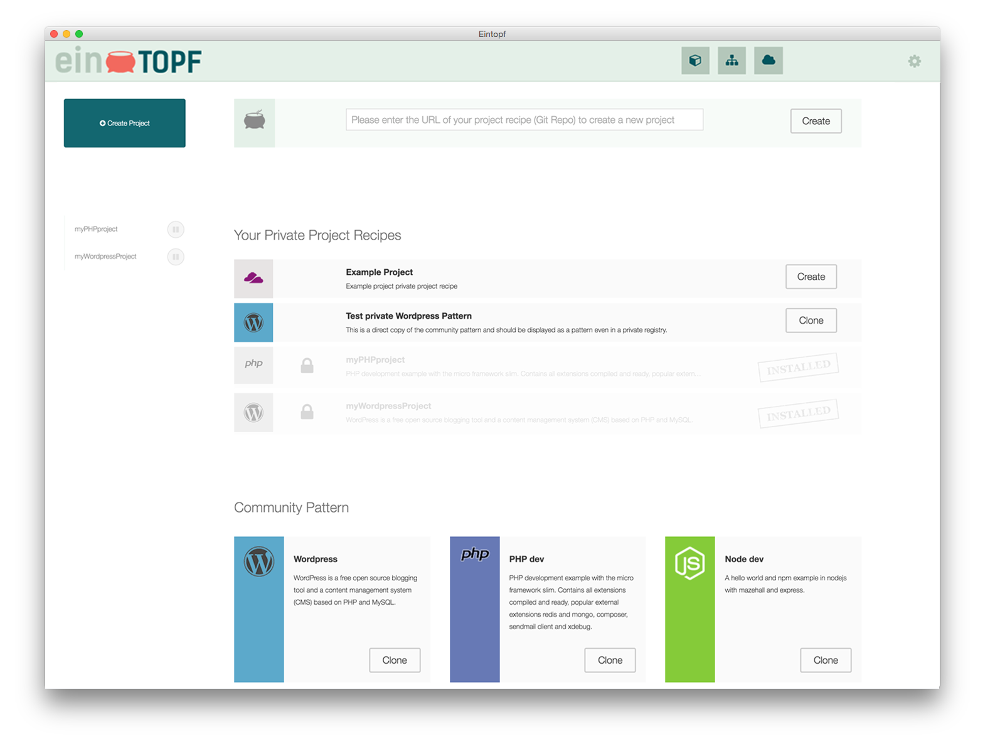

[](https://travis-ci.org/mazehall/eintopf)

#[Eintopf](https://www.eintopf.io/)

A pot with the mixture of the smart development tools Docker, Vagrant and VirtualBox. Made to ease the chore of the
daily project works.




## Prerequisites

* VirtualBox
* Vagrant >= 1.7
* Git
* WindowsOS: Gitbash (should be installed with the "set environment variables" option)


## Installation

MacOS, Windows and Linux Version available:
[Download the latest version of eintopf] (https://eintopf.io/download/)

For MacOS homebrewer:
```brew cask install eintopf``


## How does it work?

### Paths under Eintopf control

* ```$HOME/.eintopf/default``` mapped inBox to ```/vagrant```
  * The home of your Vagrantfile

* ```$HOME/.eintopf/default/configs/*``` mapped inBox to ```/vagrant/configs```
  * The home of your project descriptions with all docker configurations

* ```HOME/eintopf/*``` mapped inBox to ```/projects```
  * The home of your project sources

### Ports and proxy magic

 host port | vm port   | description |
---|---|---
 __4480__  | __4480__  | Proxy that provides all started docker container
 __4443__  | __4443__  | Proxy SSL termination point
 __31313__ | __31313__ | Eintopf GUI server


The containers being proxied must [expose](https://docs.docker.com/reference/run/#expose-incoming-ports) the port to be proxied, either by using the `EXPOSE` directive in their `Dockerfile` or by using the `--expose` flag to `docker run` or `docker create`.

Provided your DNS is setup to forward to the ip 127.0.0.1, the request will be routed to a container with the VIRTUAL_HOST env var set.

For more information see [Proxy compatibility](#proxy-compatibility) or see the proxy [documentation](https://github.com/jwilder/nginx-proxy)


## Configuration


### Eintopf config

You can configure your Eintopf through a config file in eintopfHome/eintopfNamespace/config.json (default: ~/.eintopf/default/config.json).
The configuration works partially, so you only have to set what you want to overwrite.

    {
      "app": {
        "defaultNamespace": "default", # default Namespace for eintopf home
        "pathDefaultVagrantFile": "config/Vagrantfile.default" # relative path to the Vagrant configuration
      },
      "registry": {
        "url": "http://registry.eintopf.io/files/projects.json", # set your own registry definition url here 
        "refreshInterval": "900000" # set the interval in milliseconds to load the registry
      }
    }


### Vagrantfile

The used Vagrantfile is located in <EINTOP_HOME>/<eintopfNamespace>/Vagrantfile (default: ~/.eintopf/default/Vagrantfile). You can set your own settings and provisioning there.

The following settings are necessary so that Eintopf can use Vagrant :

- Mount eintopfHome/eintopfNamespace/ in /vagrant
- Mount Eintopf projects in /projects
- Installed and running Docker with forwarded port 2375
- Use of compatible Proxy container like mkodockx/docker-nginx-proxy with forwarded port 4480 and 4443


### Environment variables

- EINTOPF_HOME # set this to use a custom Eintopf home folder
- REGISTRY_INTERVAL # set your own registry definition url here
- REGISTRY_URL # set the interval in milliseconds to load the registry

## Project pattern development

A pattern is a project configuration which can be used by Eintopf.

Minimal file system:

    example-pattern/
      package.json

The file package.json defines this package as a Eintopf pattern. Minimal package.json:

    {
      "name": "example-pattern", # pattern id
      "eintopf": {
        "name": "Example-pattern", # pattern name
        "description": "This is my example-pattern. It can be used as ..." # pattern description
      }
    }

### Set your start and stop action

To make Eintopf actually do things you have to set a start and stop action of the pattern. In this case we want to execute simple sh scripts.

File system:

    example-pattern/
      package.json
      start.sh
      stop.sh

Example package.json:

    {
      ...
      "scripts": {
        "start": "sh ./start.sh",
        "stop": "sh ./stop.sh"
      },
      ...
    }

Example start.sh:

    #/bin/sh
    
    docker run -d --name examplepatterndev -e VIRTUAL_HOST=example-pattern.dev nginx

Example stop.sh

    #/bin/sh
    
    docker stop examplepatterndev


### Custom actions

You can set custom actions which can be used in the Eintopf gui.

File system:

    example-pattern/
      package.json
      start.sh
      stop.sh
      customaction1.sh
      customaction2.sh
      
Example package.json:

    {
      ...
      "scripts": {
        "start": "sh ./start.sh",
        "stop": "sh ./stop.sh",
        "action1": "sh ./customaction1.sh",
        "action2": "sh ./customaction2.sh"
      },
      "eintopf": {
        "name": "Example-pattern",
        "description": "This is my example-pattern. It can be used as ...",
        "actions": [
        {
          "name": "customaction1",
          "script": "action1" # maps to scripts.action1
        },
        {
          "name": "customaction2",
          "warning": "my custom action 2. This should execute script customaction2.sh",
          "script": "action2" # maps to scripts.action2
        }
      ]
      ...
    }

### Proxy compatibility

The full proxy documentation can be found [here](https://github.com/jwilder/nginx-proxy).

The containers being proxied must [expose](https://docs.docker.com/reference/run/#expose-incoming-ports) the port to be proxied, either by using the `EXPOSE` directive in their `Dockerfile` or by using the `--expose` flag to `docker run` or `docker create`.

Provided your DNS is setup to forward foo.bar.com to the a host running nginx-proxy, the request will be routed to a container with the VIRTUAL_HOST env var set.

#### Multiple ports

If your container exposes multiple ports, the proxy will default to the service running on port 80.  If you need to specify a different port, you can set a VIRTUAL_PORT env var to select a different one.  If your container only exposes one port and it has a VIRTUAL_HOST env var set, that port will be selected.

#### Multiple hosts

If you need to support multiple virtual hosts for a container, you can separate each entry with commas.  For example, `foo.bar.com,baz.bar.com,bar.com` and each host will be setup the same.

#### Wildcard hosts

You can also use wildcards at the beginning and the end of host name, like `*.bar.com` or `foo.bar.*`. Or even a regular expression, which can be very useful in conjunction with a wildcard DNS service like [xip.io](http://xip.io), using `~^foo\.bar\..*\.xip\.io` will match `foo.bar.127.0.0.1.xip.io`, `foo.bar.10.0.2.2.xip.io` and all other given IPs. More information about this topic can be found in the nginx documentation about [`server_names`](http://nginx.org/en/docs/http/server_names.html).


Examples:
    
    docker run -d --name examplepatterndev -e VIRTUAL_HOST=example-pattern.dev nginx
    docker run -d --name examplepatterndev2 -e VIRTUAL_HOST=*.example-pattern.dev --expose 3000 nodejs # supports wildcard certificates
    docker run -d --name examplepatterndev3 -e VIRTUAL_HOST=example-pattern3.dev --expose 3000 nodejs

Example docker-compose.yml:

    examplepatterndev:
      image: nginx
      environment:
        - VIRTUAL_HOST=example-pattern.dev
    ...

### SSL certificates

You can add your own ssl certificates which will be used by the proxy. The certificate files have to match the VIRTUAL_HOST name and have to end with .key and .crt.

The files will be updated on pattern installation and on pattern update. They will be removed on pattern deletion. If the container was already running while installing the certs, you have to restart the container.

All certificates are collected in eintopfHome/eintopfNamespace/proxy/certs/ (default: ~/.eintopf/default/proxy/certs/)

File system:

    configs/
      example-pattern/
        package.json
        start.sh
        stop.sh
        certs/
          example-pattern.dev.key
          example-pattern.dev.crt
    proxy/
      certs/ # certificates are collected here
        example-pattern.dev.key
        example-pattern.dev.crt


----

# Development

## Structure of the project

There are **two** `package.json` files:  

__1. For development__

Sits on path: `eintopf/package.json`. Here you declare dependencies for your development environment and build scripts. **This file is not distributed with real application!**

Also here you declare the version of Electron runtime you want to use:
```json
"devDependencies": {
  "electron-prebuilt": "^0.24.0"
}
```

__2. For the application__

Sits on path: `eintopf/app/package.json`. This is **real** manifest of the application. Declare your app dependencies here.

## Project's folders

- `app` - code of your application goes here.
- `releases` - ready for distribution installers will land here.
- `resources` - resources for particular operating system.
- `tasks` - build and development environment scripts.

## Preparation

```
npm install
```
It will also download Electron runtime, and install dependencies for second `package.json` file inside `app` folder.


### Starting the app

```
npm start
```

### Adding pure-js npm modules to your app

Remember to add your dependency to `app/package.json` file, so do:
```
cd app
npm install name_of_npm_module --save
```

### Adding native npm modules to your app

If you want to install native module you need to compile it agains Electron, not Node.js you are firing in command line by typing `npm install` [(Read more)](https://github.com/atom/electron/blob/master/docs/tutorial/using-native-node-modules.md).
```
npm run app-install -- name_of_npm_module
```
Of course this method works also for pure-js modules, so you can use it all the time if you're able to remember such an ugly command.


### Making a release

**Note:** There are various icon and bitmap files in `resources` directory. Those are used in installers and are intended to be replaced by your own graphics.

To make ready for distribution installer use command:
```
npm run release
```
It will start the packaging process for operating system you are running this command on. Ready for distribution file will be outputted to `releases` directory.

You can create Windows installer only when running on Windows, the same is true for Linux and OSX. So to generate all three installers you need all three operating systems.


## Special precautions for Windows
As installer [NSIS](http://nsis.sourceforge.net/Main_Page) is used. You have to install it (version 3.0), and add NSIS folder to PATH in Environment Variables, so it is reachable to scripts in this project (path should look something like `C:/Program Files (x86)/NSIS`).


# License

The MIT License (MIT)

Copyright (c) 2015 Mazehall

Permission is hereby granted, free of charge, to any person obtaining a copy
of this software and associated documentation files (the "Software"), to deal
in the Software without restriction, including without limitation the rights
to use, copy, modify, merge, publish, distribute, sublicense, and/or sell
copies of the Software, and to permit persons to whom the Software is
furnished to do so, subject to the following conditions:

The above copyright notice and this permission notice shall be included in all
copies or substantial portions of the Software.

THE SOFTWARE IS PROVIDED "AS IS", WITHOUT WARRANTY OF ANY KIND, EXPRESS OR
IMPLIED, INCLUDING BUT NOT LIMITED TO THE WARRANTIES OF MERCHANTABILITY,
FITNESS FOR A PARTICULAR PURPOSE AND NONINFRINGEMENT. IN NO EVENT SHALL THE
AUTHORS OR COPYRIGHT HOLDERS BE LIABLE FOR ANY CLAIM, DAMAGES OR OTHER
LIABILITY, WHETHER IN AN ACTION OF CONTRACT, TORT OR OTHERWISE, ARISING FROM,
OUT OF OR IN CONNECTION WITH THE SOFTWARE OR THE USE OR OTHER DEALINGS IN THE
SOFTWARE.
